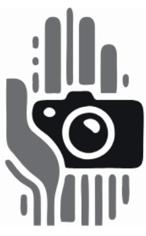

# Proyecto de Interacción Humano Computador
## SignLearn: Aprende Lengua de Señas a Través de Videos

  

## Principios de Gestalt del Logo:

- **Proximidad**: Los elementos del logo (las líneas que representan la mano y la forma de la cámara) están agrupados de manera cercana, lo que hace que el cerebro los perciba como parte de una misma figura.
- **Similitud**: Las líneas que conforman la mano son del mismo color, evitando confusión con la cámara.
- **Figura y Fondo**: La cámara y la mano se distinguen claramente del fondo blanco, resaltando el objeto principal.
- **Simetría**: El cerebro simplifica las líneas para percibir una mano en el logo.
- **Continuidad**: Las líneas fluyen detrás de la cámara, dando la sensación de que la mano la sostiene.
- **Cierre**: Aunque no están completamente delineadas, el cerebro completa las formas de la cámara y la mano.

### Realizado por:
- Sergio Mena
- Saul Condori
- Christian Pardavé

---

## Etapa 1: Propuesta del Proyecto

### 1. Introducción
El aprendizaje del lenguaje de señas sigue siendo un reto para muchas personas oyentes, limitando la interacción con personas sordas. Este proyecto, **Aprende Lengua de Señas a Través de Videos**, tiene como objetivo facilitar el aprendizaje del lenguaje de señas mediante el uso de videos interactivos. Los usuarios podrán subir videos de sus gestos, y el sistema los analizará para proporcionar retroalimentación en tiempo real, ayudando a mejorar la precisión y fluidez de los movimientos.

### 2. Planteamiento del problema
Aprender el lenguaje de señas puede ser un desafío, especialmente si no se tiene acceso a un entorno de enseñanza adecuado o a un maestro. Las barreras de comunicación pueden dificultar la práctica y la mejora de los gestos. Este proyecto propone una solución accesible basada en el uso de videos para practicar el lenguaje de señas. El sistema analizará los gestos de los usuarios, brindando retroalimentación precisa sin necesidad de dispositivos adicionales.

### 3. Objetivos
El objetivo principal es desarrollar una aplicación que permita a los usuarios aprender y practicar el lenguaje de señas subiendo videos de sus gestos. A través del análisis de los videos, el sistema proporcionará retroalimentación en tiempo real para ayudar a mejorar la técnica. Además, la aplicación será adaptable y se ajustará según las necesidades del usuario basadas en sus habilidades y progreso.

### 4. Público Objetivo
El público objetivo incluye:

- **Personas oyentes**: Quienes desean aprender el lenguaje de señas para mejorar su comunicación con personas sordas en su vida cotidiana o profesional.
- **Estudiantes y educadores**: Personas que buscan una herramienta interactiva y accesible para practicar el lenguaje de señas.

El sistema está diseñado para ser inclusivo y fácil de usar por personas de todas las edades y niveles de habilidad tecnológica.

### 5. Qué hará el proyecto
La aplicación permitirá a los usuarios aprender el lenguaje de señas de manera interactiva mediante videos. Algunas características clave incluyen:

- **Análisis de videos**: Los usuarios podrán subir videos de sus señas, y el sistema analizará los gestos para brindar retroalimentación sobre la precisión de los movimientos.
- **Traducción y práctica**: Además de analizar los gestos, la aplicación proporcionará traducciones automáticas en tiempo real, permitiendo a los usuarios entender cómo sus señas se transforman en palabras o frases.
- **Interfaz adaptable**: Los usuarios podrán personalizar la sensibilidad de la retroalimentación y el nivel de dificultad según su progreso.
- **Portabilidad y accesibilidad**: La aplicación estará disponible en dispositivos móviles, lo que permitirá a los usuarios practicar en cualquier momento y lugar.

### 6. Análisis de sistemas existentes
Existen aplicaciones como **HandTalk** que permiten traducir el lenguaje de señas a través de avatares, pero presentan limitaciones en cuanto a la enseñanza y práctica activa. Este proyecto se diferencia al enfocarse en el aprendizaje personalizado mediante la evaluación de videos de los usuarios.

- **Aspectos positivos**: HandTalk ha sido útil como herramienta de comunicación, facilitando la traducción de texto a señas.
- **Aspectos negativos**: No permite el aprendizaje activo ni ofrece retroalimentación en tiempo real sobre los gestos realizados por los usuarios, lo que limita su aplicación en la enseñanza del lenguaje de señas.

---

Este proyecto busca proporcionar una solución innovadora y accesible para aprender el lenguaje de señas, utilizando videos y análisis en tiempo real para mejorar la experiencia de aprendizaje y la práctica continua.
