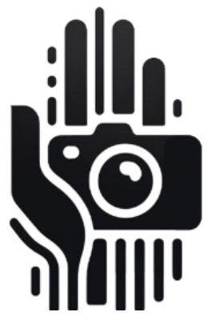

# Proyecto de Interacción Humano Computador
## Asistente de Traducción de Lengua de Señas en Tiempo Real con Cámaras y Detección de Manos

  

### Realizado por:
- Sergio Mena
- Saul Condori
- Christian Pardavé

---

## Etapa 1: Propuesta del Proyecto

### 1. Introducción
La barrera de comunicación entre personas sordas y oyentes sigue siendo un desafío significativo, ya que muchos oyentes no están familiarizados con el lenguaje de señas. Este proyecto, **Asistente de Traducción de Lengua de Señas con Cámara y Detección de Manos**, busca utilizar la visión computacional para traducir el lenguaje de señas a texto o voz en tiempo real, facilitando la interacción entre personas sordas y oyentes. Usando cámaras y algoritmos de detección de manos, el sistema ofrecerá una solución accesible y sin la necesidad de dispositivos físicos adicionales como guantes inteligentes.

### 2. Planteamiento del problema
Para las personas sordas, la comunicación con personas que no saben lenguaje de señas puede ser difícil y, a menudo, frustrante. Esta barrera se agrava en contextos donde la comunicación inmediata es crucial, como en atención médica, educación o servicios públicos. Aunque existen soluciones como intérpretes de señas o tecnologías asistivas, estas no siempre son accesibles o prácticas. Este proyecto plantea una solución que, mediante cámaras y algoritmos avanzados, permita interpretar el lenguaje de señas de forma eficiente y accesible, sin la necesidad de dispositivos adicionales.

### 3. Objetivos
El objetivo del proyecto es desarrollar un sistema basado en cámaras para la traducción automática del lenguaje de señas a texto o voz. Utilizando técnicas de detección de manos y visión por computadora, el sistema ofrecerá una solución precisa, accesible y en tiempo real, mejorando la interacción entre personas sordas y oyentes. El diseño de la interfaz se basará en principios de Interacción Humano-Computadora (HCI), asegurando una experiencia fluida para ambos tipos de usuarios. Los objetivos se ajustarán durante el desarrollo según el feedback de las pruebas de usabilidad con los usuarios.

### 4. Público Objetivo
El público objetivo se divide en dos grupos principales:

- **Personas sordas o con discapacidad auditiva**: Quienes utilizarán el sistema para traducir su lenguaje de señas a texto o voz, facilitando la comunicación en situaciones cotidianas o críticas.
- **Personas oyentes no familiarizadas con el lenguaje de señas**: Usuarios como profesionales en servicios de atención al cliente, personal médico, o cualquier persona que desee comunicarse con personas sordas de manera eficiente.

Además, el sistema estará diseñado para ser inclusivo, considerando diferentes edades, habilidades tecnológicas y contextos de uso, con el objetivo de que sea adoptado por un amplio espectro de usuarios.

### 5. Qué hará el proyecto
El proyecto implementará un sistema de reconocimiento de lenguaje de señas mediante visión computacional. Algunas de sus funcionalidades clave incluyen:

- **Traducción en tiempo real**: El sistema detectará las manos del usuario y reconocerá sus movimientos para traducir señas a texto o voz de manera instantánea.
- **Interfaz personalizable**: Los usuarios podrán elegir entre distintas configuraciones, como el idioma, la sensibilidad de la detección, y la velocidad de la traducción.
- **Integración con dispositivos móviles**: El sistema estará disponible en smartphones y tablets, facilitando su portabilidad y adopción en distintos contextos.
- **Accesibilidad sin dispositivos adicionales**: A diferencia de los guantes inteligentes, este sistema solo requerirá una cámara para funcionar, reduciendo costos y haciendo la tecnología más accesible.

El enfoque será innovador y creativo, asegurando que la interfaz sea interactiva, intuitiva y altamente funcional.

### 6. Análisis de sistemas existentes
Una de las soluciones comparables es **HandTalk**, una aplicación que traduce lenguaje de señas mediante animaciones 3D de un avatar. Si bien esta aplicación ha sido útil para algunos usuarios, presenta limitaciones significativas.

- **Aspectos positivos**: HandTalk ha facilitado la comunicación a través de un avatar que traduce de texto a señas, siendo una herramienta educativa útil.
- **Aspectos negativos**: El sistema no funciona en tiempo real con señas hechas por los usuarios. Además, la traducción depende del input de texto, lo que no permite una interacción completamente fluida. El uso de un avatar limita su capacidad de interpretar una amplia variedad de gestos y expresiones faciales, que son esenciales en el lenguaje de señas.
